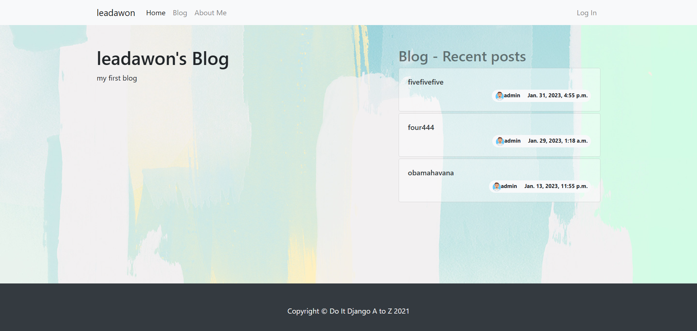
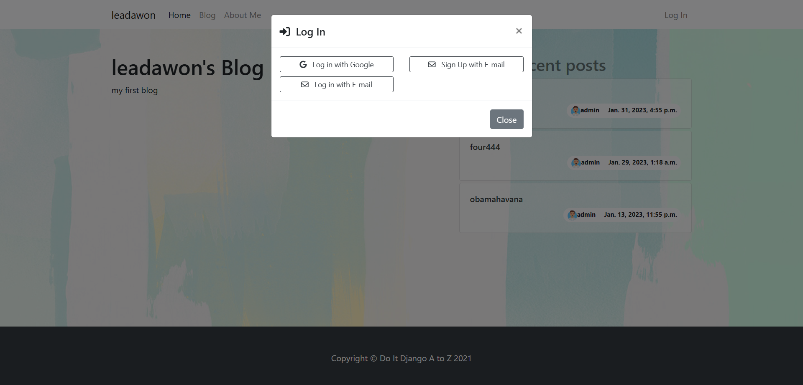
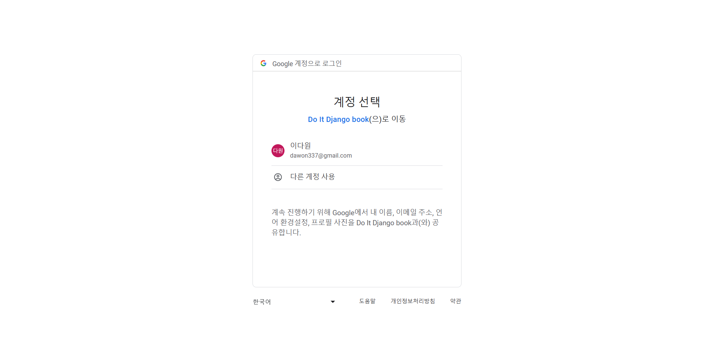
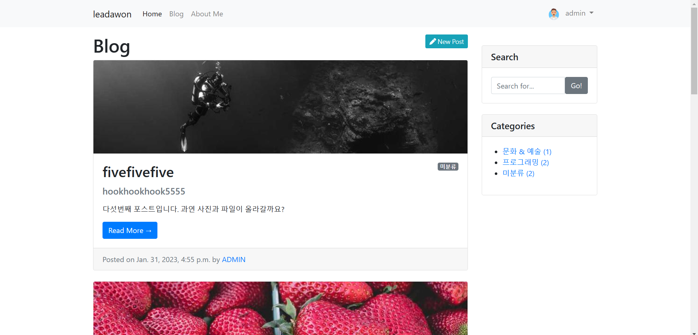
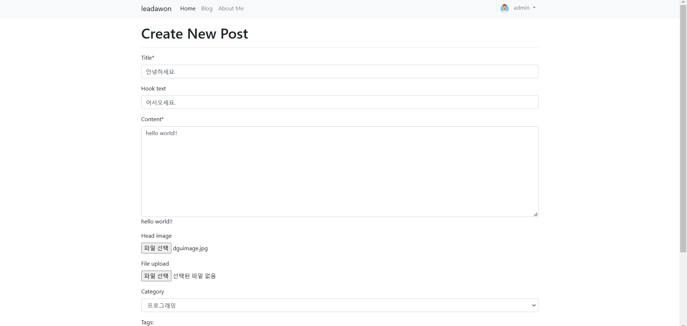
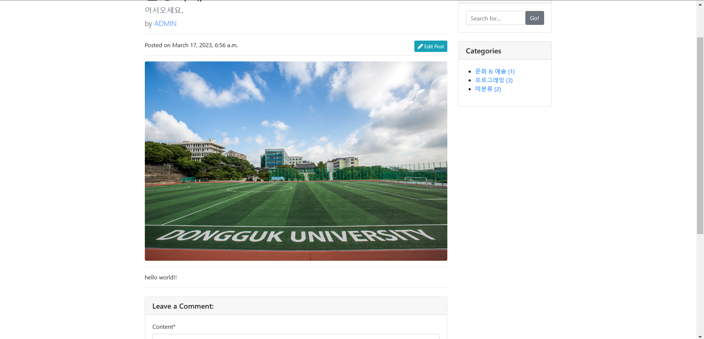
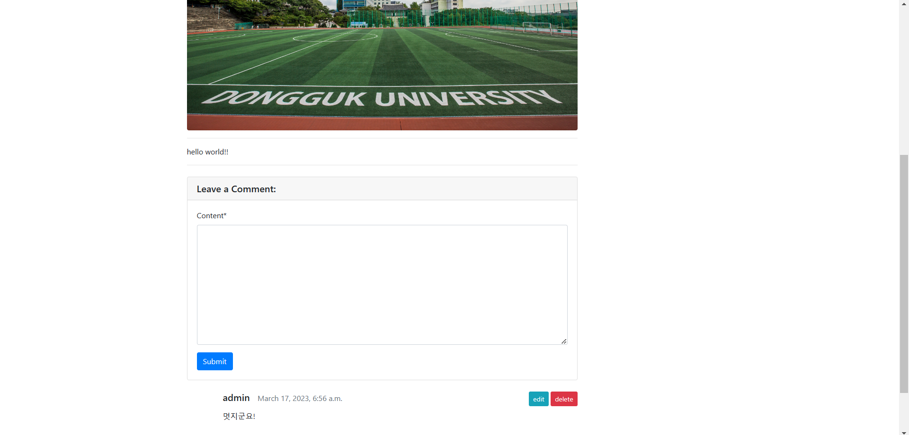
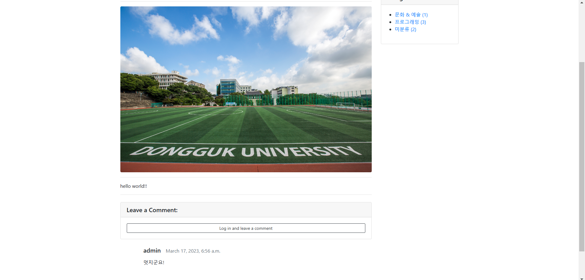

# do_it_django_atoz
[do_it_django_atoz](https://bookclub.yes24.com/BookClub/Detail/96804807)

도서를 기반으로 만들었습니다.

---

### 메인화면 입니다.

---

### 로그인 버튼을 눌렀습니다.

---

### 구글계정으로 로그인 하겠습니다. 

---

### 로그인 후 블로그 list로 이동합니다.

---

### 포스팅하겠습니다.

---

### 텍스트, 이미지, 태그 잘 적용되었습니다.

---

### 포스트에 코멘트를 남길 수도 있습니다.

---

### 자신이 남긴 포스팅, 코멘트만 수정, 삭제가 가능하며, 로그인 하지 않은 유저는 포스팅, 코멘트 작성이 제한됩니다.

